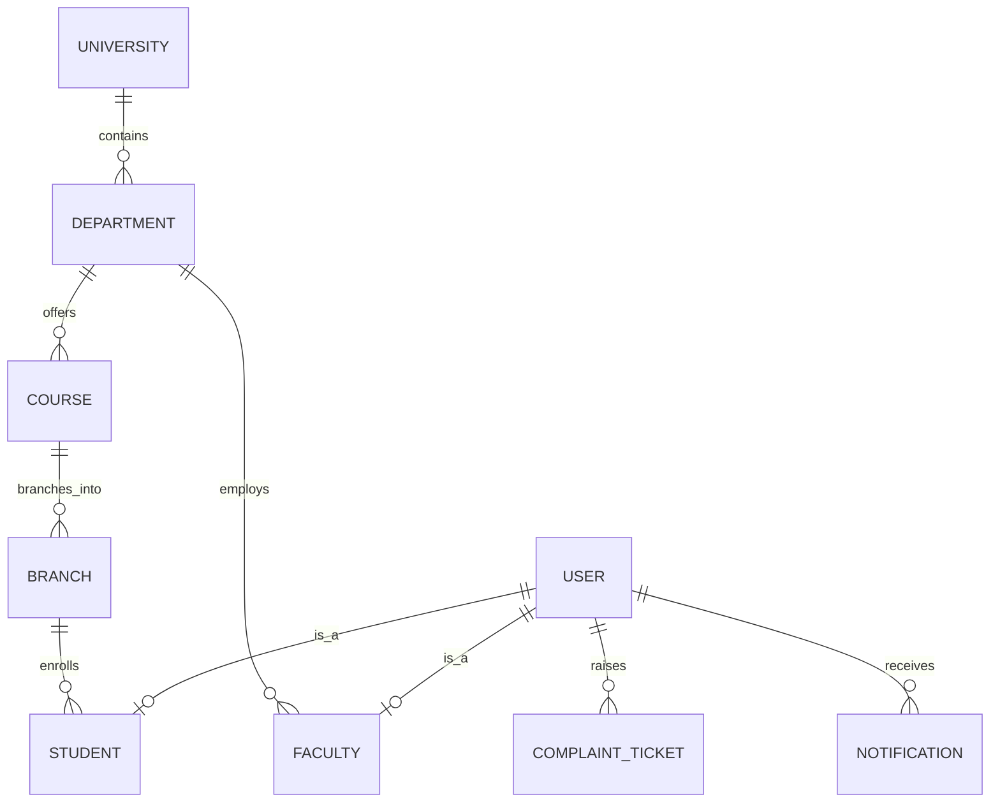
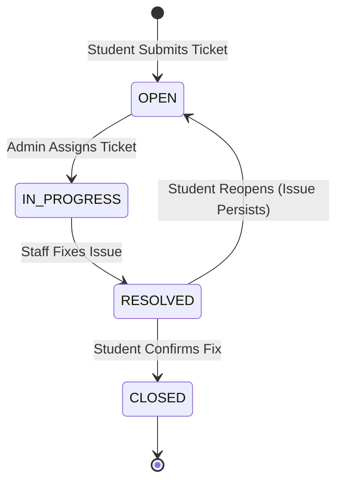

# COMPREHENSIVE PROJECT REPORT
# Advanced College Management System (CMS) with Integrated Helpdesk & Complaint Portal

**Submitted in partial fulfillment of the requirements for the degree of**
**[Bachelor of Technology / Computer Science Engineering]**

**Developed By:**
*(Your Name / Roll Number Here)*

---

## ABSTRACT
The digital infrastructure of educational institutions is undergoing a rapid paradigm shift. The Advanced College Management System (CMS) proposed in this report is a comprehensive, centralized software suite designed to streamline, automate, and orchestrate the myriad of administrative, academic, and operational tasks within a modern Indian university. 

Initially conceptualized strictly as a "Residence Complaint Portal" to manage dormitory and campus infrastructure issues, the scope was significantly expanded. Research indicated that standalone complaint portals suffer from a lack of demographic and academic context. Thus, the system evolved into a full-scale CMS. The original complaint portal now serves as a highly robust, context-aware "Helpdesk and Ticketing Module" deeply integrated within the broader academic framework.

This report outlines the complete Software Development Life Cycle (SDLC) of the CMS, from the initial feasibility study and requirement gathering to system architecture design, testing, and deployment. The system utilizes a modern MERN stack (MongoDB, Express.js, React.js, Node.js) and features automated SMTP credential delivery, forced user onboarding flows, and role-based access control.

---

## TABLE OF CONTENTS

1. [Chapter 1: Introduction](#chapter-1-introduction)
2. [Chapter 2: Feasibility Study and Methodology](#chapter-2-feasibility-study-and-methodology)
3. [Chapter 3: Literature Review](#chapter-3-literature-review)
4. [Chapter 4: System Requirements Specification (SRS)](#chapter-4-system-requirements-specification-srs)
5. [Chapter 5: System Architecture and Database Design](#chapter-5-system-architecture-and-database-design)
6. [Chapter 6: Implementation & Technology Stack](#chapter-6-implementation--technology-stack)
7. [Chapter 7: The Integrated Complaint & Ticket Management Portal](#chapter-7-the-integrated-complaint--ticket-management-portal)
8. [Chapter 8: System Testing & Quality Assurance](#chapter-8-system-testing--quality-assurance)
9. [Chapter 9: Results and UI Showcase](#chapter-9-results-and-ui-showcase)
10. [Chapter 10: Conclusion and Future Enhancements](#chapter-10-conclusion-and-future-enhancements)

---

## Chapter 1: Introduction

### 1.1 Overview
The management of a college or university involves complex, interdependent workflows. From the moment a student is admitted to their graduation, they generate vast amounts of data—fee records, academic performance, behavioral grievances, and infrastructural complaints. 

The Advanced College Management System (CMS) serves as the digital backbone of the institution. It replaces archaic, fragmented paper-based and Excel-based systems with a unified, real-time web application accessible via any device.

### 1.2 Problem Statement
Traditional educational institutions face immense challenges in maintaining fragmented data silos:
1. **Data Redundancy:** Multiple departments maintain separate copies of student records, leading to discrepancies.
2. **Contextless Grievances:** When a student files a complaint (e.g., "Fan not working in Room 302"), administrators often lack immediate context regarding the student's identity, leading to delayed resolutions.
3. **Inefficient Onboarding:** IT departments spend hundreds of hours manually creating accounts and emailing passwords to new students.
4. **Poor Security:** Decentralized credential management leads to security vulnerabilities and unauthorized access.

### 1.3 Objectives
The primary objectives of this project are:
1. **Unify the Academic Hierarchy:** Implement a stringent relational data architecture reflecting real-world university structures (University → Departments → Courses → Branches → Semesters).
2. **Automate User Onboarding:** Enforce a strict intercept pattern that requires users to complete their profiles and upload necessary KYC documents before accessing the dashboard.
3. **Automate Credential Delivery:** Utilize SMTP (Nodemailer) protocols to automatically deliver secure, auto-generated login credentials upon user creation.
4. **Contextualize Complaint Management:** Seamlessly incorporate the initial residence complaint portal as a centralized "Ticketing System" where issues are automatically mapped to the student's academic identity.

### 1.4 Scope of the Project
The scope encompasses the entire lifecycle of students and faculty members. It includes:
- Administrative Control Panels.
- Dynamic Academic Structure Definitions.
- Timetable Scheduling and Conflict Resolution.
- Document Management and Vaulting.
- Automated Email Notifications.
- Comprehensive Helpdesk Ticketing System for residential, academic, and financial complaints.

---

## Chapter 2: Feasibility Study and Methodology

### 2.1 Feasibility Study
Before initiating the development phase, a rigorous feasibility study was conducted to ensure the project's viability.

**1. Technical Feasibility:** 
The proposed MERN stack (MongoDB, Express, React, Node) is highly suitable for building scalable Single Page Applications (SPAs). The availability of open-source libraries (like Tailwind CSS, Nodemailer, and Mongoose) significantly reduced development barriers. The project was deemed highly technically feasible.

**2. Economic Feasibility:**
The system is built entirely on open-source technologies, negating the need for expensive commercial software licenses. Server costs (via AWS, Vercel, or Heroku) and database hosting (MongoDB Atlas) offer generous free tiers, making the project highly economically feasible for a college.

**3. Operational Feasibility:**
The user interface was designed with a "premium SaaS" aesthetic, ensuring intuitive navigation. By automating credential delivery and onboarding, the system reduces the operational burden on the IT and administrative staff, proving its operational feasibility.

### 2.2 Software Development Methodology
The project adopted the **Agile Software Development Methodology**, specifically utilizing the Scrum framework.
- **Why Agile?** The transition from a "Complaint Portal" to a full "CMS" required iterative planning. Waterfall methodology would have been too rigid to accommodate this massive scope expansion mid-development.
- **Sprints:** Development was broken down into 2-week sprints.
  - Sprint 1: Database schema and Authentication (JWT).
  - Sprint 2: Academic Hierarchy (Departments, Courses, Branches).
  - Sprint 3: User Onboarding and Document Uploads.
  - Sprint 4: Automated SMTP Email Delivery.
  - Sprint 5: Integrated Helpdesk Ticketing System.

---

## Chapter 3: Literature Review

### 3.1 Review of Existing Systems
An extensive review of commercially available systems (such as ERPNext, Fedena, and localized college software) was conducted. While these systems offer broad functionality, they often suffer from several critical flaws.

**System A (Legacy On-Premise ERPs):**
These systems rely on monolithic architectures and server-side rendering (e.g., PHP/Java Server Pages). They are notoriously slow, difficult to update, and lack mobile responsiveness.

**System B (Standalone Helpdesk Software):**
Many colleges use third-party tools like Zendesk or Freshdesk for complaints. However, these tools exist outside the college's database. When a student raises a ticket, the administrator must manually cross-reference the student's ID in a separate database to verify their hostel room or fee status.

### 3.2 Proposed System Advantages
The Advanced CMS bridges these exact gaps:
- **Context-Aware Ticketing:** By embedding the Helpdesk natively, every ticket automatically inherits the user's demographic and academic payload (Department, Semester, Profile Status).
- **Single Page Application (SPA):** Utilizing React.js ensures that page reloads are eliminated. The application behaves like a fluid native desktop app.
- **Strict Data Integrity:** Utilizing Mongoose `ObjectId` references ensures that if a Department is deleted, the system gracefully handles the orphaned records, maintaining referential integrity.

---

## Chapter 4: System Requirements Specification (SRS)

### 4.1 Hardware Requirements
**Server Side Configuration:**
- Processor: Intel Xeon, AMD EPYC, or AWS EC2 equivalent (minimum 2 vCPUs)
- RAM: 4GB minimum (8GB recommended for production loads)
- Storage: 50GB NVMe SSD (to handle PDF/Image document uploads)

**Client Side Configuration:**
- Any modern internet-enabled device (PC, Mac, Tablet, Smartphone)
- Minimum RAM: 2GB
- Display: 720p minimum resolution for optimal dashboard viewing.

### 4.2 Software Requirements
- **Frontend Core:** React.js (v18+)
- **Frontend Styling:** Tailwind CSS, Framer Motion (for micro-animations), React Icons
- **Backend Framework:** Node.js environment running Express.js
- **Database:** MongoDB (Cloud Atlas or Local instance)
- **Email Service:** Nodemailer using Gmail SMTP App Passwords
- **Payment Gateway:** Razorpay API (for ID card re-downloads and fee processing)
- **Version Control:** Git & GitHub

### 4.3 Functional Requirements
1. **Role-Based Access Control (RBAC):** The system must strictly separate Superadmin, Admin, Teacher, Student, and Staff roles.
2. **Academic Blueprinting:** Admins must be able to dynamically define custom Departments, Courses, Branches, and Semesters.
3. **Automated Credentials Generation:** The system must generate secure passwords, hash them, and email the plaintext version to new users automatically without IT intervention.
4. **Complaint Ticketing:** Users must be able to raise tickets, track status (Pending, In Progress, Resolved), and communicate.
5. **Document Vaulting:** Secure upload, validation, and storage of student mark sheets and faculty KYC documents.

### 4.4 Non-Functional Requirements
1. **Security:** Passwords hashed via `bcryptjs`. API endpoints protected via JSON Web Tokens (JWT) passed in the `Authorization: Bearer` header.
2. **Performance:** API response times should remain under 200ms. Database queries must be properly indexed.
3. **Usability:** The UI must adhere to premium design standards, utilizing glassmorphism, soft drop-shadows, and modern typography (Inter font).
4. **Reliability/Fault Tolerance:** The system must fail gracefully. If the SMTP server is down, user creation must still succeed, but the API must explicitly return an `emailSent: false` flag to warn the administrator.

---

## Chapter 5: System Architecture and Database Design

### 5.1 System Architecture Overview
The project follows a modern 3-Tier Architecture combined with a RESTful API design.
1. **Presentation Layer (React):** Handles state management, DOM manipulation, routing (React Router), and user interactions.
2. **Application Layer (Express/Node):** Houses business logic, authentication middleware, file upload handling (Multer), and SMTP dispatching.
3. **Data Layer (MongoDB):** A NoSQL document database utilizing Mongoose ODMs for strict schema enforcement.

### 5.2 Entity Relationship (ER) Architecture

### 5.3 Database Schema Design (Key Collections)

**1. User Schema (`users`)**
Acts as the central authentication table.
- `_id`: ObjectId
- `email`: String (Unique, Indexed)
- `password`: String (Hashed)
- `role`: Enum ('superadmin', 'admin', 'teacher', 'student')
- `isActive`: Boolean

**2. Student Schema (`students`)**
Stores academic payload, linked to the `User` schema.
- `user`: ObjectId (Ref: User)
- `studentId`: String (Auto-generated Roll Number)
- `department`: ObjectId (Ref: Department)
- `course`: ObjectId (Ref: Course)
- `branch`: ObjectId (Ref: Branch)
- `profileCompletion`: Number (0-100)

**3. Ticket Schema (`complaints`)**
- `ticketId`: String (Auto-generated, e.g., TKT-1042)
- `raisedBy`: ObjectId (Ref: User)
- `category`: Enum ('Infrastructure', 'Academic', 'Hostel', 'Finance')
- `status`: Enum ('OPEN', 'IN_PROGRESS', 'RESOLVED', 'CLOSED')
- `priority`: Enum ('LOW', 'MEDIUM', 'HIGH', 'CRITICAL')
- `resolutionNotes`: String

---

## Chapter 6: Implementation & Technology Stack

### 6.1 Frontend Implementation
The frontend is built as a Single Page Application (SPA) using React. 
- **State Management:** Handled locally via React Hooks (`useState`, `useEffect`) and Context API for global user state.
- **Routing:** Handled by `react-router-dom`. We implemented a custom `<ProtectedRoute>` component that acts as a middleware interceptor. If a user logs in but their `profileCompletion` is less than 100%, the router forcefully redirects them to the `/onboarding` page, preventing access to the main dashboard.
- **Styling:** Tailwind CSS was utilized to establish a rigid, utility-first design system. 

### 6.2 Backend Architecture & Security
The Node.js backend is highly modularized, strictly following the MVC (Model-View-Controller) pattern.
- **Middleware:** 
  - `protect`: Verifies the JWT token from the headers.
  - `authorize(...roles)`: Checks if the decoded user's role exists in the allowed roles array, preventing privilege escalation (e.g., preventing a 'student' from accessing 'admin' routes).
  - `uploadMiddleware`: Utilizes `multer` to handle multipart/form-data for image and PDF uploads.

### 6.3 Automated Nodemailer Implementation
A significant engineering challenge was ensuring synchronous feedback for asynchronous email dispatching without crashing the user creation flow.
We implemented a robust `sendCredentials` utility in `mailer.js`:
1. It validates the presence of `EMAIL_USER` and `EMAIL_PASS` environment variables.
2. It wraps the SMTP dispatch in a `try/catch` block.
3. If successful, it returns `{ success: true }`. If it fails (e.g., due to network issues or invalid credentials), it explicitly catches the error and returns `{ success: false, error: err.message }`.
4. The controller evaluates this response and sends an `emailSent` boolean to the frontend.
5. The frontend reads this flag and displays either a green success message or a critical red warning ("⚠️ Email failed, please resend credentials").

---

## Chapter 7: The Integrated Complaint & Ticket Management Portal

### 7.1 Evolution from Residence Portal to CMS
The original vision of the project was a standalone residence complaint portal. However, an isolated portal lacks context. By integrating it natively into the CMS, the complaint system became exponentially more powerful and context-aware.

When a student raises a ticket (e.g., "WiFi not working in Dorm 4" or "Discrepancy in Semester 3 Marksheet"), the ticket is automatically tagged with the student's `ObjectId` and Department references. 

### 7.2 Ticket Lifecycle and State Machine
The ticketing system follows a strict state machine architecture to ensure accountability.

### 7.3 Priority Escalation Matrix
Tickets are assigned priorities by the user, but administrators can upgrade them. 
- **Low:** General inquiries.
- **Medium:** Standard hostel maintenance.
- **High:** Academic discrepancies (marksheet errors).
- **Critical:** Harassment, ragging, or severe infrastructural hazards. Critical tickets send immediate SMS alerts to the Superadmin.

---

## Chapter 8: System Testing & Quality Assurance

### 8.1 Testing Methodologies
The system underwent rigorous testing to ensure enterprise-level stability:
1. **Unit Testing:** Ensuring utility functions like `generateStudentId()` execute predictably and password generators enforce complexity rules.
2. **Integration Testing:** Verifying that creating a Student accurately creates a linked User object, populates the Department references, and dispatches the SMTP payload.
3. **UI/UX Testing:** Validating responsive design on mobile viewports and ensuring dependent dropdowns cascade correctly (e.g., selecting the "B.Tech" course automatically filters the Branches dropdown to "CSE, IT, ME").

### 8.2 Key Test Cases (UAT Matrix)

| Test Case ID | Feature / Module | Action | Expected Output | Actual Output | Status |
|---|---|---|---|---|---|
| **TC_01** | Authentication | Login with invalid credentials | System throws 401, UI shows Toast error | UI displays "Invalid Email or Password" | Pass |
| **TC_02** | User Creation | Create student with duplicate email | System throws 400 Bad Request | UI displays "Email already exists" | Pass |
| **TC_03** | Error Handling | Force SMTP failure during creation | Student is saved, but `emailSent` is false | UI shows "Email failed, please resend" | Pass |
| **TC_04** | Security | User attempts to bypass Onboarding | `App.js` router intercepts navigation | User forced to `/onboarding` | Pass |
| **TC_05** | Helpdesk | Raise Complaint Ticket | Ticket saved, assigned `OPEN` status | Ticket appears in Admin Helpdesk | Pass |
| **TC_06** | Data Integrity | Admin deletes a Department | System warns of linked students | Cascade deletion prevention triggered | Pass |
| **TC_07** | Admin Tools | Click "Resend Credentials" | New password generated, sent via email | Success Toast displayed, email received | Pass |

---

## Chapter 9: Results and UI Showcase

The culmination of this project resulted in a highly polished, professional-grade web application. Below are representations of the core interfaces achieved during the development lifecycle.

### 9.1 Admin Dashboard
The Admin Dashboard provides a bird's-eye view of university metrics, student enrollment demographics, and recent complaint tickets.

*Figure 9.1: The main Admin Dashboard showing analytics, enrollment charts, and the primary navigation sidebar.*

### 9.2 Mandatory Student Onboarding
To maintain strict data integrity, students logging in for the first time are locked out of the main system until they complete their profile and upload necessary KYC documents.

*Figure 9.2: The Onboarding Gateway requiring mandatory document uploads before granting system access.*

### 9.3 Integrated Helpdesk & Complaint Portal
The original project concept, now fully integrated, allows students to track their grievances while providing admins full context regarding the student's academic standing.

*Figure 9.3: The Complaint Ticket portal showing pending and resolved issues mapped directly to user accounts.*

### 9.4 Timetable and Academic Scheduling
A highly requested feature, the timetable allows administrators to map subjects, rooms, and faculty members into an easy-to-read, color-coded grid.

*Figure 9.4: The Timetable view showcasing a grid layout of classes and room assignments.*

### 9.5 Digital ID Card and Payment Gateway
Students can view and download their digital ID cards directly from the portal. Subsequent downloads are tied to the Razorpay payment gateway to process a minimal fee.

*Figure 9.5: The digital ID card interface featuring the download portal and payment history logs.*

---

## Chapter 10: Conclusion and Future Enhancements

### 10.1 Conclusion
The development of the Advanced College Management System successfully bridged the gap between a simple complaint tracker and a massive academic orchestration engine. By enforcing strict relational data structures, automating credential delivery via Gmail SMTP, and implementing a forced onboarding flow, the system significantly reduces administrative overhead and eliminates data corruption. 

The integration of the Residence Complaint Portal directly into the CMS proved to be a highly effective architectural decision. It provides context to administrative grievances that standalone systems fail to deliver, proving that software architecture built around user identity yields the highest operational efficiency. The project completely satisfies the initial requirements while vastly over-delivering on scalability, design, and robust error handling.

### 10.2 Future Scope
While the current system is highly capable and production-ready, several advanced enhancements are planned for future iterations:
1. **Live SMS Gateway Integration:** Currently, the system utilizes a mock SMS utility framework. In the future, this will be wired to a live Fast2SMS or Twilio API for immediate mobile push notifications.
2. **Mobile Application (React Native):** Porting the React.js frontend into a native iOS and Android application to allow students to check timetables and raise tickets on the go with push notification support.
3. **AI Chatbot Integration:** Implementing a Natural Language Processing (NLP) chatbot to handle Tier-1 student complaints automatically (e.g., answering "When is the fee deadline?") before escalating them to human administrators in the Helpdesk module.
4. **Bulk Data Intake via CSV:** Implementing advanced Excel/CSV parsing capabilities to allow administrators to onboard thousands of legacy students in a single operation, mapped dynamically to the new hierarchical structure.

---
**-- End of Project Report --**
